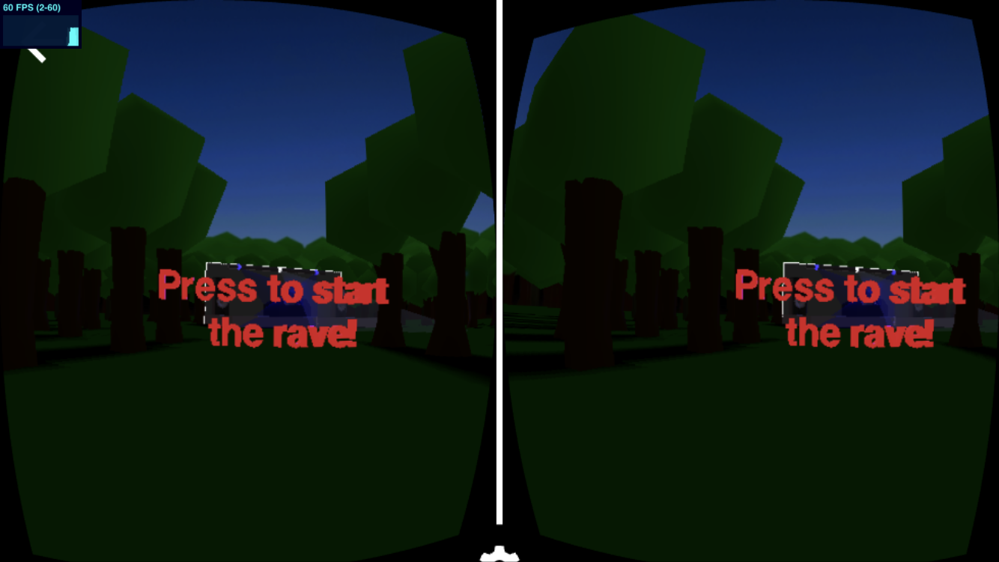

# PolyRave VR
*The virtual forrest rave*

- 2 spatialized mono audio sources using equalpower panning for the music
- First order ambisonics audio for the ambient sound
- Fotographed 360 image using GoPro Fusion for the sky
- Motion capture for the DJ animation

## Main dependecies

- Typescript
- Node.js
- WebVR
- Three.js
- Webpack
- Web Audio API

## Demo

[https://davjo664.github.io/polyrave-vr](https://davjo664.github.io/polyrave-vr)

## Authors

Jesper Lund

David Johansson

Tobias Pettersson
